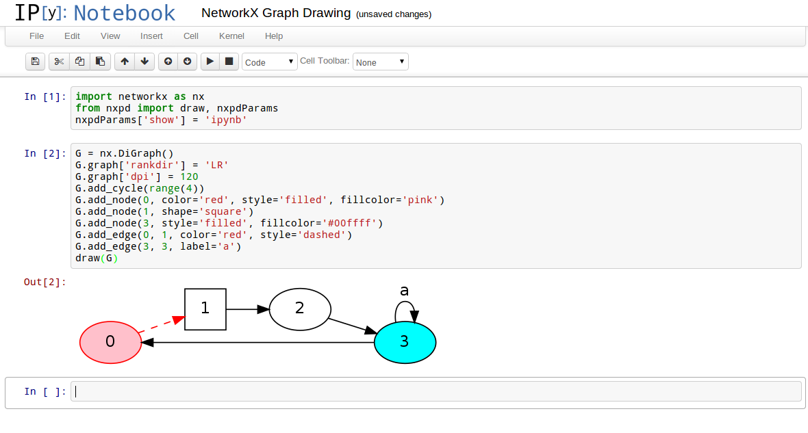

nxpd
====

`nxpd` is a Python package for visualizing NetworkX graphs using `pydot`
and `graphviz`. Support is also provided for inline displays within IPython
notebooks.

Installation
============

Installation is easy:

    pip install nxpd

Alternatively, you can use `git`:

    git clone https://github.com/chebee7i/nxpd

Then, move into the `nxpd` directory and install the old fashioned way:

    python setup.py install

Usage
=====

Basic usage is as follows:

    import networkx as nx
    from nxpd import draw
    G = nx.cycle_graph(4, create_using=nx.DiGraph())
    draw(G)

This will display a PNG (by default) using your operating system's default
PNG viewer.  Alternatively, if you are in an IPython notebook, then you
might like the image displayed inline.  This is achieved by setting the `show`
parameter of the `draw` function.

    draw(G, show='ipynb')

If you want all graphs to be drawn inline, then you can set a global parameter.

    from nxpd import nxpdParams
    nxpdParams['show'] = 'ipynb'
    draw(G)

Any graph/node/edge attribute that is supported by DOT is passed through to
graphviz (via pydot).  All others are skipped.

    G = nx.DiGraph()
    G.graph['rankdir'] = 'LR'
    G.graph['dpi'] = 120
    G.add_cycle(range(4))
    G.add_node(0, color='red', style='filled', fillcolor='pink')
    G.add_node(1, shape='square')
    G.add_node(3, style='filled', fillcolor='#00ffff')
    G.add_edge(0, 1, color='red', style='dashed')
    G.add_edge(3, 3, label='a')
    draw(G)

